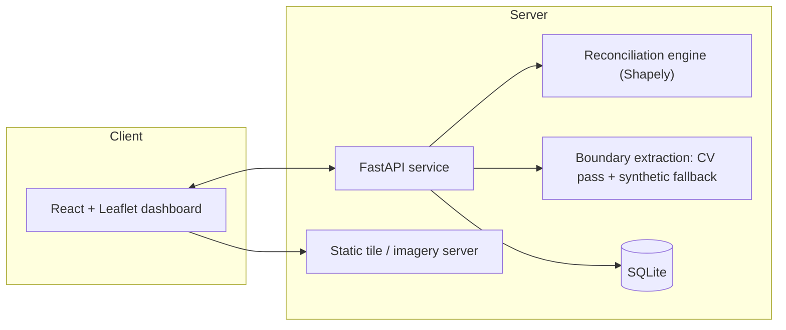
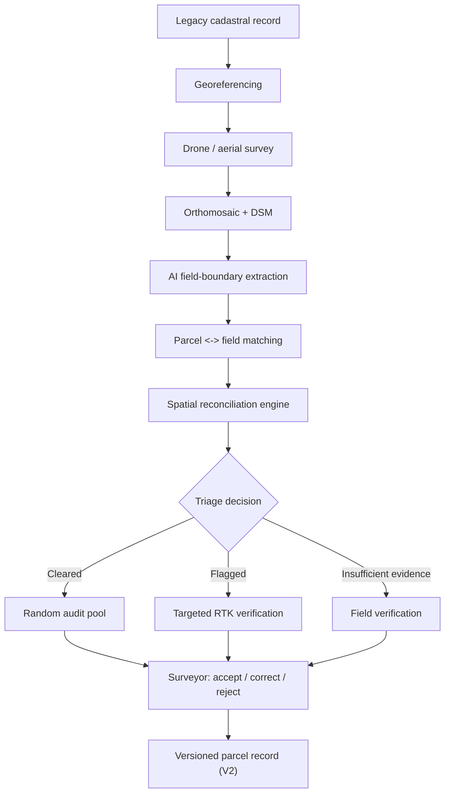

# Rural Land Resurvey Triage — PRD

Prototype for SIH. One village, 10–30 parcels, full pipeline from a legacy cadastral
record to a versioned, evidence-backed parcel record — without a blanket RTK resurvey.

**Handoff target:** GLM 5.3 (implementation)
**Status:** Ready to build
**Source scope doc:** `rural-land-resurvey-technical-document.md`
**This document:** turns that scope into a buildable spec — data model, formulas,
thresholds, API surface, screen specs. Where the source doc left a decision open,
it's made explicitly below and marked as an assumption, not asserted as fact.

---

## The Problem

Cadastral records drift from ground reality over decades — manual survey error,
land-use change, undocumented splits and merges. Resurveying every parcel with
RTK-grade fieldwork is accurate but far too slow and expensive to run at scale.

This prototype demonstrates a triage layer in front of that expensive step: use
aerial imagery and AI-assisted boundary detection to decide, per parcel, whether
the existing record can be trusted, needs a targeted correction, or can't be
judged from imagery alone — and reserve RTK fieldwork for the parcels that
actually need it.

## What This Prototype Proves

- The full pipeline runs end-to-end on one village (10–30 parcels): legacy record
  → georeferencing → aerial survey → AI extraction → matching → reconciliation →
  triage → selective RTK verification → versioned record.
- Triage classification meaningfully narrows which parcels need fieldwork, without
  silently rewriting any legal record.
- Every decision carries an explainable evidence trail, and every correction is a
  new version, never an in-place edit.
- A surveyor is always the one who accepts, corrects, or rejects — the system
  recommends, it doesn't decide.

## Non-Goals

Carried forward from the source scope, unchanged:

- Resurveying an entire district or state
- Determining legal ownership
- Automatically altering authoritative government records
- Replacing surveyors
- Replacing Bhunaksha or existing resurvey programmes
- Proving national-scale accuracy or nationwide cost savings
- A complete, production government deployment

## Actors

| Actor | Role in the prototype |
|---|---|
| Field surveyor | Reviews flagged / insufficient-evidence parcels, records accept / correct / reject |
| Reviewing official | Views the dashboard, reads evidence, exports records |
| Demo evaluator | Walks the five-screen flow end to end |

No real auth is in scope. A role toggle (Surveyor / Reviewer) in the UI is enough
to gate which actions are visible — see **Assumptions**.

---

## Architecture





## Tech Stack

| Layer | Choice | Why |
|---|---|---|
| Frontend | React (Vite) + TypeScript, Tailwind, `react-leaflet`, Recharts | Fast to scaffold, GeoJSON overlays are first-class in Leaflet, no map-provider key needed for OSM tiles |
| Backend | Python, FastAPI, Pydantic | Shapely/GeoPandas live in the same language as the geometry math — no serialization boundary between API and reconciliation engine |
| Geometry engine | Shapely (in-process, not in-DB) | At 10–30 parcels, running geometry ops in Python is simpler and faster to build than standing up PostGIS |
| Store | SQLite, single file | Zero setup, checked into the repo for reproducible demos; geometries stored as GeoJSON text, parsed on read |
| Imagery | Static files served by FastAPI (GeoTIFF/COG or PNG + world file) | No tile-server infra needed at this scale |
| Boundary extraction | OpenCV (Canny + contours + polygon simplification) with a synthetic fallback generator | See Module 04 — guarantees the demo never depends on a model performing well on one specific image |

No cloud infra is required to build this — see **Deployment** below for how it
ships for the demo.

## Deployment

Frontend deploys to **Vercel** as a static build — one shareable URL for
judges (`https://<project>.vercel.app`). Vercel's serverless functions don't
get persistent disk, so the FastAPI backend (SQLite file + served imagery)
doesn't run there: it needs a small separate host with persistent storage —
Render, Railway, and Fly.io all work on a free tier — and the frontend talks
to it via a `VITE_API_BASE_URL` env var set at build time. Judges only ever
see the one Vercel link; the backend host is invisible to them.

If a single-domain deploy becomes a hard requirement later, the backend would
need to move to Vercel serverless functions backed by a hosted Postgres (Neon
or Vercel Postgres) instead of local SQLite — a real rewrite of the store
layer, not a config change, so it's called out here rather than assumed.

---

## Data Model

All geometries are stored as GeoJSON in WGS84 (EPSG:4326). All distance and area
math in the reconciliation engine runs in a projected CRS (local UTM zone) —
reproject in, compute, reproject out. This matters: support-ratio and boundary-
displacement numbers are meaningless in degrees.

```python
class Parcel(BaseModel):
    id: str
    village_id: str
    survey_number: str                 # e.g. "142/3"
    recorded_area_ha: float
    recorded_geometry: dict            # GeoJSON Polygon, WGS84
    ror_owner_name: str                # MOCK ONLY — see Assumptions
    source: Literal["MOCK", "IMPORTED"]
    created_at: datetime

class ControlPoint(BaseModel):
    pixel_x: float
    pixel_y: float
    lat: float
    lon: float

class LegacyMap(BaseModel):
    id: str
    village_id: str
    raster_path: str
    control_points: list[ControlPoint]
    affine_transform: list[float]      # 6-parameter affine
    rmse_m: float

class RTKPoint(BaseModel):
    point_id: str
    lat: float
    lon: float
    elevation_m: float
    horizontal_accuracy_m: float
    vertical_accuracy_m: float
    captured_at: datetime

class AerialSurvey(BaseModel):
    id: str
    village_id: str
    orthomosaic_path: str
    dsm_path: str | None
    resolution_cm_per_px: float
    capture_date: date
    checkpoints: list[RTKPoint]

class AIFieldPolygon(BaseModel):
    id: str
    survey_id: str
    geometry: dict                     # GeoJSON Polygon
    confidence: float                  # 0–1
    detected_features: list[Literal[
        "BOUNDARY", "BUND", "FENCE", "ROAD", "IRRIGATION_CHANNEL"
    ]]
    source: Literal["CV_MODEL", "SYNTHETIC_FALLBACK"]

class MatchResult(BaseModel):
    id: str
    parcel_id: str
    field_polygon_ids: list[str]
    match_type: Literal["ONE_TO_ONE", "SPLIT", "MERGE", "NO_MATCH"]
    match_confidence: float

class EvidenceReport(BaseModel):
    id: str
    parcel_id: str
    area_diff_ha: float
    area_diff_pct: float
    boundary_displacement_m: float
    iou: float
    support_ratio_pct: float
    occlusion_fraction: float
    topology_status: Literal["PASS", "FAIL"]
    topology_issues: list[str]         # e.g. ["NEIGHBOR_OVERLAP_EXCEEDS_TOLERANCE"]
    uncertainty_score: float           # 0 (best) – 1 (worst)
    evidence_quality: Literal["GOOD", "MODERATE", "POOR"]
    computed_at: datetime

class TriageDecision(BaseModel):
    id: str
    parcel_id: str
    state: Literal["CLEARED", "FLAGGED", "INSUFFICIENT_EVIDENCE"]
    reason_codes: list[str]
    evidence_report_id: str
    computed_at: datetime

class RTKVerification(BaseModel):
    id: str
    parcel_id: str
    checkpoints: list[RTKPoint]
    observed_error_m: float
    corrected_geometry: dict | None    # GeoJSON Polygon, present if CORRECT
    surveyor_decision: Literal["ACCEPT", "CORRECT", "REJECT"]
    surveyor_notes: str
    verified_by: str
    verified_at: datetime

class ParcelVersion(BaseModel):
    id: str
    parcel_id: str
    version_number: int
    geometry: dict
    area_ha: float
    verification_status: Literal["UNVERIFIED", "CONFIRMED", "CORRECTED", "ESCALATED"]
    evidence_report_id: str | None
    surveyor_action: Literal["ACCEPT", "CORRECT", "REJECT"] | None
    timestamp: datetime
    previous_version_id: str | None
    previous_version_hash: str | None
    record_hash: str
```

---

## Pipeline

### 01 — Pilot Data Ingestion

A mock-data generator produces one village with 10–30 procedurally generated
parcels: organic (non-rectangular) polygons on a loose grid, survey numbers in
the local `NNN/N` convention, plausible recorded areas. Every screen that
displays this data shows a **"PROTOTYPE DATA — NOT AN OFFICIAL RECORD"** label,
per the source doc's own allowance for mock government data. Output: a GeoJSON
`FeatureCollection` seeding the `Parcel` table.

### 02 — Legacy Map Georeferencing

Input: a scanned legacy map image and control points tying pixel coordinates to
known lat/lon. Output: a 6-parameter affine transform and its RMSE in meters.

**Demo-mode approach (assumption, see below):** rasterize the mock cadastral
layer, apply a deliberate distortion (rotation + scale drift + noise), then run
the actual georeferencing algorithm to recover it. This exercises the real
control-point/affine-fit code path without requiring an actual scanned legacy
map, and the recovered RMSE becomes a real, non-fabricated number.

### 03 — Aerial Survey Ingestion

No drone is available for this build. The pipeline takes its orthomosaic from
either of two sources:

- **Pre-existing dataset:** a real, publicly available orthomosaic or
  high-resolution satellite image over an agricultural area, labeled as
  externally sourced rather than this project's own survey.
- **Simulated:** a synthetic orthomosaic rendered procedurally from the mock
  cadastral layer — the same generation approach as the synthetic legacy map
  in Module 02, extended with a plausible field texture (crop rows, bunds,
  soil-color variation) so boundary extraction has something realistic to
  work against.

Input schema is unchanged either way: orthomosaic (GeoTIFF/COG or PNG + world
file), optional DSM, a `resolution_cm_per_px` field. Since no RTK/PPK hardware
is available (see Module 08), the survey checkpoints are simulated rather than
field-collected, drawn from a configurable positional-accuracy distribution so
downstream georeferencing-quality metrics stay meaningful instead of pinned to
zero error. One representative image/site is sufficient for the demo, not a
fleet.

### 04 — AI Field-Boundary Extraction

Three tiers, same output schema, so downstream modules don't care which
produced the polygon:

- **Tier 1 (target):** a trained segmentation model for field-boundary
  extraction — in progress, not yet the primary path for the current build.
- **Tier 2 (interim real):** classical CV — Canny edge detection → contour
  extraction → Douglas-Peucker simplification on the orthomosaic, tagged
  features (boundary / bund / fence / road / irrigation channel) from line
  geometry and spectral cues.
- **Tier 3 (fallback — in use for now):** a deterministic synthetic generator
  that perturbs the cadastral polygon with controlled noise, and on a
  configurable fraction of parcels deliberately produces a split, a merge, or
  no polygon at all — so the matching and triage logic has real edge cases to
  demonstrate regardless of which upstream tier is ready.

Wire the pipeline to Tier 3 first so matching, reconciliation, triage, and the
dashboard can be built and demoed without waiting on the model. Tier 1 or
Tier 2 output slots in later against the same `AIFieldPolygon` schema — nothing
downstream changes.

Every `AIFieldPolygon` records `confidence` (0–1) and `source` so the UI can be
honest about which path produced it.

### 05 — Parcel–Field Matching

For each parcel, compute IoU against every AI polygon in the survey, then
classify:

| match_type | Rule |
|---|---|
| `ONE_TO_ONE` | Exactly one AI polygon overlaps with IoU ≥ `MATCH_MIN_IOU_ONE_TO_ONE`, and it isn't a better match for any other parcel |
| `SPLIT` | ≥2 AI polygons overlap the parcel, combined IoU ≥ `MATCH_SPLIT_COMBINED_IOU`, no single one clears the one-to-one threshold |
| `MERGE` | One AI polygon overlaps ≥2 parcels, each above `MATCH_MERGE_MIN_OVERLAP_FRAC` of its own area |
| `NO_MATCH` | Best IoU below `MATCH_MIN_IOU_FLOOR` |

### 06 — Spatial Reconciliation Engine

All figures below are computed per parcel, against its best-matched AI polygon
(or polygons, for split/merge), in a projected CRS.

- **Area difference:** `area_diff_ha = |recorded_area_ha − observed_area_ha|`,
  `area_diff_pct = area_diff_ha / recorded_area_ha × 100`
- **IoU:** `area(intersection) / area(union)` of the two polygons
- **Boundary displacement — Average Symmetric Boundary Distance (ASBD):**
  densify both rings to a vertex every `BOUNDARY_SAMPLE_INTERVAL_M`; for each
  vertex on ring A find the nearest point on ring B and vice versa; ASBD is the
  mean of all those distances, in meters. (Deliberately not "Hausdorff" — that
  term means the *max* of the min-distances and is dominated by a single
  outlier vertex; the mean is more stable for a boundary-quality signal.)
- **Support ratio:** buffer the AI-detected boundary features by
  `BOUNDARY_SUPPORT_BUFFER_M`; `support_ratio_pct` = the fraction of the
  cadastral polygon's perimeter length that falls inside that buffer, ×100.
- **Topology status:** `PASS` unless the polygon is non-simple / unparseable
  (`GEOMETRY_INVALID`) or its overlap with a neighboring parcel exceeds
  `TOPOLOGY_MAX_NEIGHBOR_OVERLAP_PCT` of its own area
  (`NEIGHBOR_OVERLAP_EXCEEDS_TOLERANCE`). `GEOMETRY_INVALID` also forces
  `INSUFFICIENT_EVIDENCE` downstream — a broken polygon can't be reconciled at all.
- **Occlusion fraction:** estimated fraction of the parcel obscured by
  vegetation/shadow/cloud in the source imagery (NDVI or shadow-mask heuristic
  on the real CV path; sampled from a configurable distribution on the
  synthetic fallback path).
- **Uncertainty score** (0 best – 1 worst), a weighted blend:

  ```
  uncertainty_score = 0.35*(1 - ai_confidence)
                     + 0.15*normalize(georef_rmse_m)
                     + 0.30*occlusion_fraction
                     + 0.20*(1 - support_ratio_pct/100)
  ```

- **Evidence quality:** `GOOD` if `uncertainty_score ≤ 0.25`, `MODERATE` if
  `≤ 0.5`, `POOR` otherwise.

### 07 — Three-State Triage Decision

Deterministic, in this priority order:

```text
1. INSUFFICIENT_EVIDENCE if any of:
     match_type == NO_MATCH
     ai_confidence < 0.50
     occlusion_fraction > 0.40
     evidence_quality == POOR
     topology_issue == GEOMETRY_INVALID

2. CLEARED if all of:
     match_type == ONE_TO_ONE
     area_diff_pct        <= 3.0
     boundary_displacement_m <= 0.50
     support_ratio_pct    >= 90.0
     topology_status      == PASS
     evidence_quality in {GOOD, MODERATE}

3. Otherwise: FLAGGED
```

`reason_codes` are emitted alongside every decision for the evidence panel —
e.g. `AREA_DIFF_EXCEEDS_TOLERANCE`, `LOW_SUPPORT_RATIO`, `SPLIT_DETECTED`,
`POOR_IMAGERY`, `NO_MATCHING_FIELD`.

**CLEARED** parcels go to the random audit pool. **FLAGGED** and
**INSUFFICIENT_EVIDENCE** parcels go to field verification.

### 08 — RTK Field Verification

No real RTK/GNSS hardware is available for the demo, so manual correction is
the primary path: the surveyor redraws the boundary in-app using a polygon
editor over the map and enters the observed error directly. Real checkpoint
CSV import (schema above) plus a corrected GeoJSON polygon stays supported in
the data model for a future deployment with actual hardware, but the demo
doesn't exercise it.

Every verification ends in one surveyor decision:

| Decision | Effect |
|---|---|
| `ACCEPT` | New version created, geometry unchanged, `verification_status = CONFIRMED` |
| `CORRECT` | New version created with the corrected geometry and recomputed area, `verification_status = CORRECTED` |
| `REJECT` | No geometry change accepted, `verification_status = ESCALATED` for higher-level review — never silently discarded |

### 09 — Versioned Parcel Record

Append-only, hash-chained for tamper evidence (not a blockchain — a
lightweight, adequate-for-scope chained hash):

```
record_hash = SHA256(canonical_json({
    parcel_id, version_number, geometry, area_ha,
    verification_status, evidence_report_id, surveyor_action,
    timestamp, previous_version_hash
}))
```

`V1.previous_version_hash = null` (genesis). Every later version references
the prior version's id and hash, so any edit to history breaks the chain
visibly.

### 10 — Demonstration Dashboard

Five screens, wired to the API below.

**Screen 1 — Village Overview.** Map with all parcels colored by triage state
(🟢🟠🔴), a filterable list alongside, and a summary count row. Click a parcel
→ Screen 2.

**Screen 2 — Parcel Comparison.** Cadastral polygon (solid) vs AI-observed
polygon (dashed) over the orthomosaic, with a layer toggle and both area
labels visible. Shows the `match_type` badge.

**Screen 3 — Evidence Panel.** Metric cards: area deviation, boundary
displacement, support ratio, uncertainty score, evidence quality, match type,
plus the `reason_codes` that explain the triage outcome. A "Send to field
verification" action for anything not `CLEARED`.

**Screen 4 — Field Verification.** RTK checkpoints and corrected boundary
plotted against the original, an observed-error readout, and the
accept/correct/reject control with a notes field.

**Screen 5 — Final Record.** Approved parcel detail, version-history timeline
(each entry showing its short hash and the evidence it's linked to), and a
JSON export.

A persistent KPI strip (not a separate screen) sits in the nav across all five
— see KPI Definitions below.

---

## API Surface

| Method | Path | Purpose |
|---|---|---|
| GET | `/api/villages/{village_id}/parcels` | Parcel list with current triage state — Screen 1 |
| GET | `/api/parcels/{parcel_id}` | Full parcel detail |
| GET | `/api/parcels/{parcel_id}/comparison` | Cadastral + matched AI geometry — Screen 2 |
| GET | `/api/parcels/{parcel_id}/evidence` | Latest evidence report + reason codes — Screen 3 |
| POST | `/api/pipeline/run-full` | Re-run georeference → extraction → matching → reconciliation → triage for the village (demo reset) |
| POST | `/api/parcels/{parcel_id}/rtk-verification` | Submit checkpoints + decision — Screen 4 |
| GET | `/api/parcels/{parcel_id}/versions` | Version history — Screen 5 |
| GET | `/api/kpis` | Computed KPI summary for the nav strip |

---

## Reference Config — Default Calibration

The source doc calls the triage boundary a *calibrated* tolerance, which means
these belong in a config file, not hardcoded:

| Parameter | Default | Meaning |
|---|---|---|
| `MATCH_MIN_IOU_ONE_TO_ONE` | 0.30 | Min IoU for a clean 1:1 match |
| `MATCH_MIN_IOU_FLOOR` | 0.05 | Below this, treated as no overlap |
| `MATCH_SPLIT_COMBINED_IOU` | 0.50 | Combined IoU to call a split |
| `MATCH_MERGE_MIN_OVERLAP_FRAC` | 0.30 | Min overlap fraction per parcel to call a merge |
| `CLEAR_MAX_AREA_DIFF_PCT` | 3.0 | % |
| `CLEAR_MAX_BOUNDARY_DISPLACEMENT_M` | 0.50 | meters |
| `CLEAR_MIN_SUPPORT_RATIO_PCT` | 90.0 | % |
| `INSUFFICIENT_MIN_AI_CONFIDENCE` | 0.50 | Below → insufficient |
| `INSUFFICIENT_MAX_OCCLUSION_FRAC` | 0.40 | Above → insufficient |
| `BOUNDARY_SUPPORT_BUFFER_M` | 1.0 | Buffer used for support-ratio calc |
| `BOUNDARY_SAMPLE_INTERVAL_M` | 0.5 | Vertex-densify interval for ASBD |
| `TOPOLOGY_MAX_NEIGHBOR_OVERLAP_PCT` | 2.0 | % of parcel area |

These reproduce the worked example in the source doc (0.42 m shift, 94%
support, PASS topology → cleared) and leave headroom for real data to shift
them during the demo.

---

## KPI Definitions

- **False-clear rate** = (CLEARED parcels found wrong on RTK audit) / (CLEARED parcels audited) × 100 — the headline number.
- **% cleared without full RTK** = CLEARED count / total parcel count × 100
- **Boundary RMSE** = RMS of `boundary_displacement_m` across all RTK-verified parcels, against the RTK-corrected boundary as ground truth
- **Area error** = mean absolute area error % against RTK-corrected ground truth, across verified parcels
- **False-flag rate** = (FLAGGED parcels that RTK verification found already correct) / (FLAGGED parcels verified) × 100
- **Processing time per parcel** = mean wall-clock time from ingestion to triage decision, from pipeline log timestamps

---

## Demo Script

1. Screen 1 — village loads, parcels colored, counts visible.
2. Click a flagged parcel → Screen 2, cadastral vs AI boundary overlay.
3. Screen 3 — evidence and reason codes explaining why it was flagged.
4. Screen 4 — run the three seeded examples: one cleared parcel through random
   audit, one flagged parcel through full RTK verification, one
   insufficient-evidence parcel through field verification.
5. Screen 5 — versioned record, hash chain, evidence links.
6. KPI strip — false-clear rate and the rest, computed from the three
   verifications just run.

---

## Suggested Build Sequence

1. **Scaffolding** — FastAPI + React skeletons, SQLite schema, config file for the thresholds table.
2. **Data layer** — mock village/parcel generator, Screen 1 wired to real generated data.
3. **Georeferencing + aerial ingestion** — synthetic warp-then-recover pipeline, sample orthomosaic ingestion.
4. **Core logic** — boundary extraction (both tiers), matching, reconciliation formulas, triage decision. Prioritize correctness here over UI polish.
5. **Screens 1–3** wired end to end against real pipeline output.
6. **RTK verification + versioning** — checkpoint import, manual-correction editor, accept/correct/reject, hash chain, Screens 4–5.
7. **KPIs + polish** — KPI endpoint and nav strip, "PROTOTYPE DATA" labeling pass, empty/error states, demo rehearsal.

---

## Assumptions & Design Decisions

Decisions made in this document beyond what the source scope specified:

- All cadastral, legacy-map, and imagery data are synthetic, procedurally
  generated, and labeled "PROTOTYPE DATA" wherever shown — consistent with the
  source doc's own allowance for mock government data.
- SQLite over PostGIS: at 10–30 parcels, in-process Shapely is simpler to build
  and demo than standing up a spatial database.
- AI extraction is three interchangeable tiers (trained segmentation model,
  classical CV, synthetic fallback) behind one schema. A trained segmentation
  model is being attempted separately; the current build runs on the synthetic
  fallback so the rest of the pipeline isn't blocked on it.
- Legacy georeferencing is demonstrated via a synthetic distort-then-recover
  cycle on the mock cadastral layer, since an actual scanned legacy village map
  is unlikely to be available for the prototype.
- No drone flight will happen for this build — the aerial survey uses either a
  pre-existing public orthomosaic/satellite image or a fully simulated one
  (Module 03), with survey checkpoints simulated to match, since no RTK/PPK
  hardware is available either.
- No real RTK/GNSS hardware will be available for the demo — manual in-app
  correction is the primary path for Module 08. Real checkpoint CSV import
  stays in the data model for a future deployment but isn't exercised in the
  prototype.
- Triage thresholds are config values, not constants in code.
- No authentication — a UI role toggle (Surveyor / Reviewer) is sufficient.
- Frontend deploys to Vercel for a single shareable link; the backend runs on
  a separate small host with persistent storage, since Vercel serverless
  functions can't hold the SQLite file or served imagery (see **Deployment**).

## Out of Scope (recap)

District/state-scale resurvey, legal ownership determination, automatic edits
to authoritative records, replacing surveyors or Bhunaksha, national-scale
accuracy or cost claims, full government deployment.
